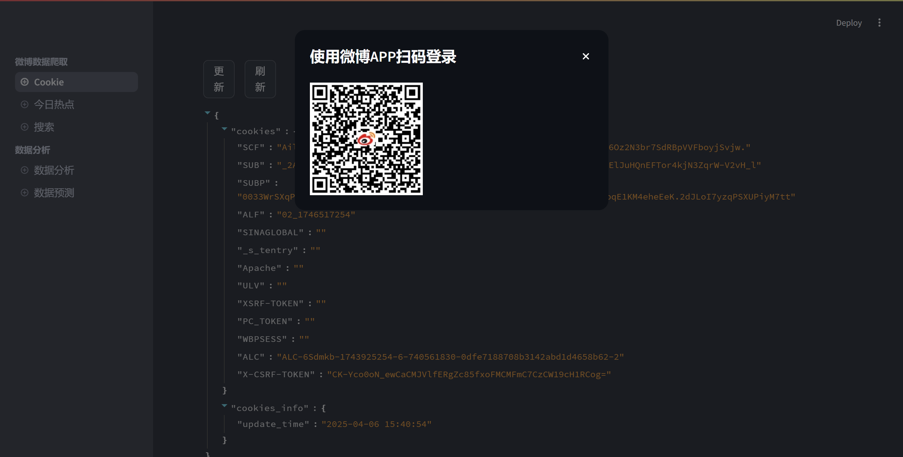
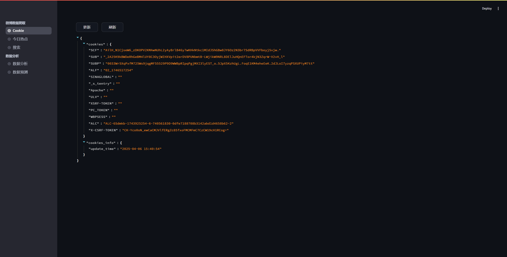
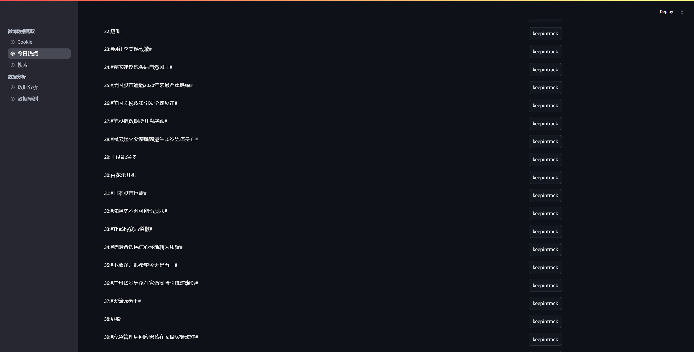
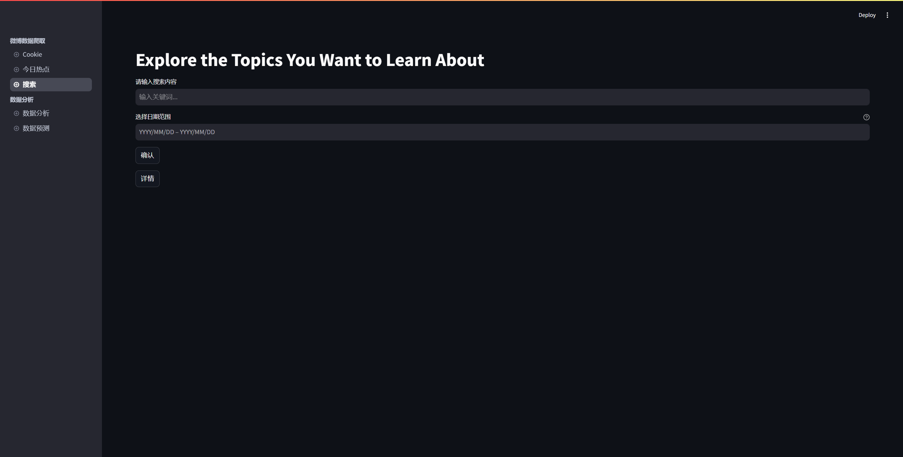
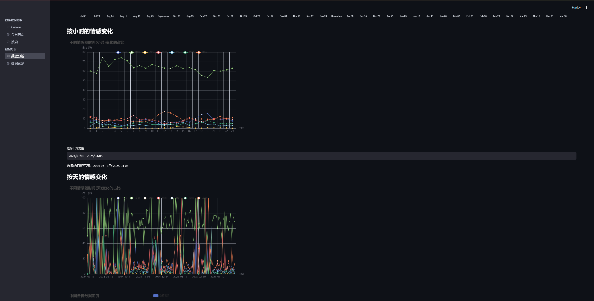
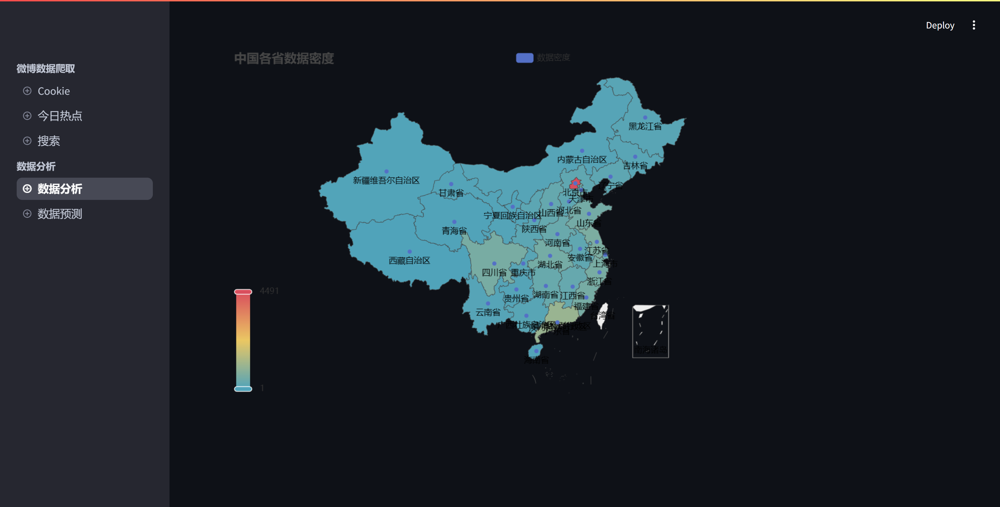
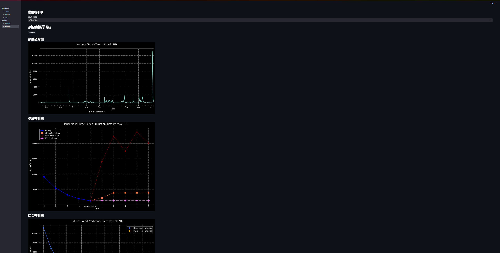

# NIS3366：舆情监控预测系统
## ✈️ 介绍
随着社交媒体的快速发展，微博作为中国最大的社交媒体平台之一，每天产生大量热点话题。为了更好地监控和分析微博上的舆情，我们开发了一个热点舆情监控软件。该软件能够实时爬取微博热榜 TOP50 热搜话题，并对每个话题下的帖子进行情感分析和地域分布统计，同时提供热度预测功能。

项目是一个舆情监控预测系统。整个项目分成Crawler(爬虫)，Data_management(数据管理与处理)，Front_end(前端展示)，Prediction(热度计算与趋势预测)。整体采用streanlit进行框架搭建，具有高移植性，经测验，可在Windosw，macOS，Ubuntu，WSL(Ubuntu)等主流系统上良好运行。
## 🎯 项目目标
- 实时监控微博热榜 TOP50 热搜话题。
- 对每个热搜话题下的帖子进行情感分析和地域分布统计。
- 实现用户自主选择话题进行查询的功能。
- 提供帖子数量随时间变化的折线图、情感分析结果随时间变化的折线图、以及帖子数量按省份的地域分布图。
- 实现热搜话题的热度预测功能。
## 🧩 模块分析与设计
### 🐛 爬虫模块
    微博数据采集功能通过 Crawler 模块实现，使用request、httpx、parsel等库，支持指定时间段话题微博的动态爬取、解析和存储。
### 📊 数据管理与处理
#### - ❤️ 情感分析
    采用通义千问实验室StructBERT情绪分类-中文-七分类-base模型，对微博及其评论进行情感分析，包含恐惧、愤怒、厌恶、喜好、悲伤、高兴、惊讶七种情绪。
#### - 🫙 数据存储
    将爬取的帖子数据存储在 MongoDB 数据库中。
    每个集合的名称为热搜话题名称，集合内部包含以下键值对：content_all：帖子内容。location：发帖地点（省份）。uid：帖子id。emotion：帖子情感分类结果（恐惧、愤怒、厌恶、喜好、悲伤、高兴、惊讶）。
### 📈 前端展示
    采用strealit框架构建web应用程序，支持热搜查询，话题热度追踪和话题情感分析展示，支持用户自主选择话题。
### 🔝 热度计算与趋势预测
    借助python库statsmodels与tensorflow构建分段ARIMA模型、ETS模型与LSTM模型，并根据待预测时间序列的统计特征拟合参数集成三种模型得到预测结果
## 项目效果
扫描二维码登录

自动获取Cookie

获取Top50热的微博话题

也可以选择自己搜索自己感兴趣的话题

开始爬虫，进行微博博文、评论、点赞数据统计处理

情感分析

地域分析

热度计算与预测

## ⚙️ 运行
### 💻 本地直接运行
    conda create -n  NIS3366
    pip install -r requirements.txt
    streamlit run ./Front_end/main.py
### 🐳 Docker 运行
    cd ./Nis3366_docker
    # 需要打开本地docker，然后执行下面步骤
    docker-compose up --build

